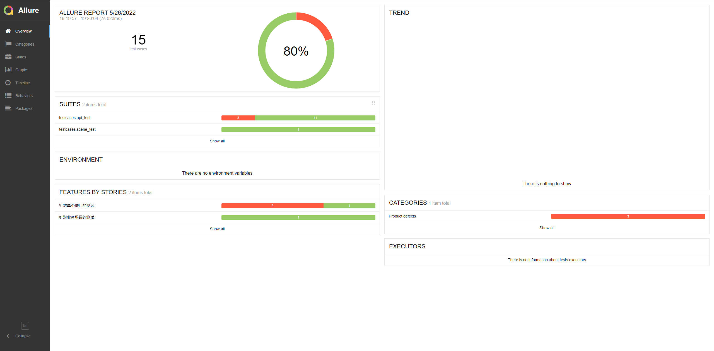

# TesTool

## 简介

基于PyTest+Requests+Allure+Jenkins的接口自动化测试框架。欢迎star:star:支持。

## 技术栈

- Python和Requests来处理HTTP请求。
- Pytest作为测试执行器。
- Allure进行测试报告管理。
- Jenkins进行持续集成。

本项目在实现过程中，将整个项目进行了高度封装，包括HTTP接口封装、关键字封装、测试用例封装。

首先利用Python把HTTP接口封装成Python接口，接着把这些Python接口组装成一个个的关键字，再把关键字组装成测试用例，而测试数据则通过CSV文件和YAML文件进行统一管理，然后再通过Pytest测试执行器来运行这些脚本，并结合Allure输出测试报告，最后通过Jenkins进行接口测试持续集成。


## 环境配置

首先，下载项目的源码，然后使用pip进行依赖包的安装。

```
pip install -r requirements.txt
```

然后，修改`config/setting.ini`配置后，执行下面的命令来运行所有的测试用例。

```shell
pytest
```
我这里针对自己的一个项目进行的接口测试，如果你需要看到完整的测试效果，请自行部署[该Web项目]()。


## 目录结构

- api ==> 接口封装层，如封装HTTP接口
- common ==> 各种工具类
- config ==> 配置文件
- core ==> requests请求方法封装、关键字返回结果类
- data ==> 数据驱动，测试数据管理
- log ==> 日志记录文件
- operation ==> 关键字封装层，把多个Python接口封装为关键字
- templates ==> 用于测试报告的HTML模板
- testcases ==> 测试用例
- Jenkinsfile ==> Jenkins流水线脚本
- pytest.ini ==> pytest配置文件
- README.md ==> 本项目的说明文档
- requirements.txt ==> Python依赖包


## 关键字封装说明

关键字应该是具有一定业务意义的，在封装关键字的时候，可以通过调用多个接口来完成。在某些情况下，比如测试一个充值接口的时候，在充值后可能需要调用查询接口得到最新账户余额，来判断查询结果与预期结果是否一致，那么可以这样来进行测试：

1. 首先，可以把`充值-查询`的操作封装为一个关键字，在这个关键字中依次调用充值和查询的接口，并可以自定义关键字的返回结果。 
2. 接着，在编写测试用例的时候，直接调用关键字来进行测试，这时就可以拿到关键字返回的结果，那么断言的时候，就可以直接对关键字返回结果进行断言。


## 测试数据

**针对API测试：**

采用CSV来存放测试数据，为了适配自定义的csv解析器，请务必对测试数据携带表头。

**针对场景测试：**

采用YAML来存放数据，这是为了适配不同业务之间全局变量的存储。

## 后处理

集成Jenkins后Allure插件会自动生成测试报告，但是本地使用的话执行`pytest`之后，会得到一个测试报告的原始文件，但这个时候还不能打开成HTML的报告，还需要使用下面的命令查看或者生成HTML报告。

```shell
allure serve ./report
```

```shell
allure generate ./report --clean
```

测试报告，效果如下。



## 感谢

[wintests-pytestDemo](https://github.com/wintests/pytestDemo)
